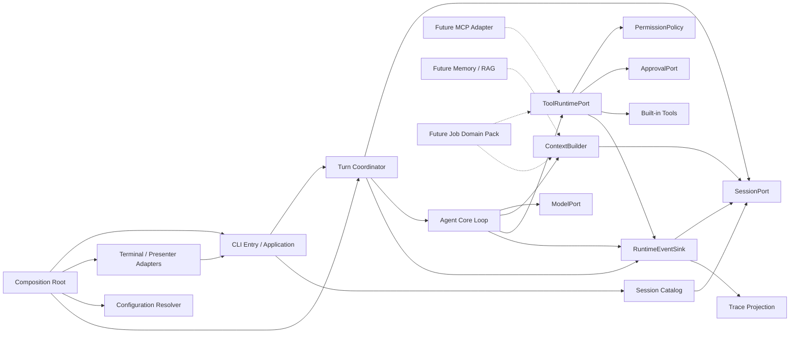

# Agent Runtime 架构

状态：`Approved`

批准日期：2026-08-12

## 架构目标

JDAgent 先建设领域无关的 Agent Runtime，再通过独立领域包增加求职能力。第一阶段学习和验证通用机制；第二阶段验证这些接口能否承载真实的数据采集、检索、分析和评测需求。

```text
Job Agent
= Agent Runtime
+ Job Domain Tools
+ Job Knowledge and Retrieval
+ Job Workflows
+ Job-specific Evals
```

## 设计原则

- Agent Loop 保持小而稳定，复杂机制通过明确端口和服务组合。
- 领域策略依赖 Runtime 公共能力；Runtime 不依赖求职领域概念。
- 外部系统通过 Adapter 接入，Provider、存储和传输细节不进入 Core。
- Session Event 是历史事实；模型消息、CLI 输出和压缩结果都是投影。
- 每项机制必须可单独测试、观察失败并由学习者解释。
- 只为已批准需求增加抽象，不为假设中的未来框架预留空壳。
- CLI 应用层可以管理交互生命周期和短暂 UI 状态，但不得复制 Agent Loop、Session 事实或权限
  判断；终端库只能通过 Adapter 接入。
- 外部成熟 Agent CLI 是非规范性参考，不是项目事实来源、兼容目标或可直接复制的架构模板。

## 逻辑结构



## 模块职责

### Composition Root 与 Turn Coordinator

- Composition Root 只负责读取安全配置、选择 Adapter 并组装依赖，不承载 Turn 业务规则。
- Turn Coordinator 是应用层 use case，负责一次 Turn 的生命周期：追加输入事件、启动 Core Loop、完成最终事件并返回 `StopReason`。
- v0.1 CLI 只负责输入输出和实现交互式 `ApprovalPort`，不直接编排 Model、Tool 或 Session。
- v0.2 CLI 应用层负责 REPL 生命周期、斜杠命令、Session 导航、取消和 Presenter 选择；它通过
  Coordinator、Session Catalog 与 Permission 用例工作，不直接编排 Model、Tool 或 JSONL。

### CLI Application、Terminal 与 Presentation

- CLI Entry Point 保持薄，只解析启动参数、选择交互/Headless 模式、调用配置解析与 Composition Root，
  并映射退出码。
- Interactive Application 管理当前 Session 引用和
  `STARTING/IDLE/RUNNING_TURN/WAITING_APPROVAL/RUNNING_TOOL/CANCELLING/EXITING` 短暂状态，
  不保存消息历史副本；Presenter 使用的 UI 标签映射以
  [CLI 应用层架构](cli-application.md#interactive-application)为准。
- Terminal Adapter 将输入转换为有类型用户动作；Prompt Toolkit 类型不越过 Adapter seam。
- Presentation Module 将同源 Runtime Event 转换为 Rich、纯文本或 JSON 输出；Presenter 不改变事实。
- Session Catalog 提供发现、选择和命名用例；其索引是可重建投影，不替代 Session 生命周期事实。
- 详细设计见 [CLI 应用层架构](cli-application.md)。

### Agent Core

- 驱动一次 Turn 的状态转换和终止判断。
- 只依赖项目领域类型和端口，不知道 CLI、DeepSeek、JSONL 或具体工具实现。
- 在每次模型调用前委托 `ContextBuilder` 从规范事件投影生成标准请求。
- 不自行拼接历史或 Provider payload，不直接访问文件系统或环境变量。

### Model Gateway

- 定义 `ModelPort`、统一事件、能力声明和错误类别。
- 每个 Provider Adapter 负责协议转换、流解析和 Provider 异常映射。
- 首个真实 Adapter 是 DeepSeek；Fake Model 是测试依赖，不是特殊运行分支。

### Tool Runtime

- 维护工具身份、Schema、Handler 和风险信息的单一注册表。
- 通过 `ToolRuntimePort` 统一封装查找、参数校验、权限、审批、超时、结果转换和执行事件。
- 工具 Handler 不接触模型消息或 Agent Loop。

### Permission Policy

- 根据工具身份、参数、workspace 和风险输出 `ALLOW`、`ASK` 或 `DENY`。
- 审批由 `ApprovalPort` 的 CLI 等交互 Adapter 完成；Policy 不直接读取终端。
- 不可信工具声明不能扩大宿主机权限边界。

### Session

- 通过 `SessionPort` 追加和读取不可变事件。
- JSONL 是 v0.1 的存储 Adapter，不是领域模型。
- 会话恢复先重放事件，再生成上下文投影；不得从 CLI 文本猜测历史。
- v0.2 的 Session Catalog、workspace 分区和异常恢复位于应用/存储侧；Core 仍只依赖窄
  `SessionPort`。最终半行可以在保留备份后有限修复，中间损坏继续 fail closed；副作用状态
  不确定时不得自动继续。

### Context Engine

- 将已选事件、System Prompt 和工具描述构造成 `ModelRequest`。
- v0.1 只做确定性投影和预算检查；压缩、记忆和 RAG 后续作为独立策略加入。
- 所有丢失信息的转换必须保留来源和可观察的触发原因。
- 薄 ContextBuilder 必须先于 Agent Loop 落地；Loop 不得存在临时 Provider 请求拼装路径。

### Observability

- 消费模型、工具、权限、会话和终止过程产生的规范 `RuntimeEvent`。
- 结构化 Trace 用于调试、学习、回归测试和后续 Eval。
- Session 持久化恢复所需事件，Trace 是同一规范事件流的消费投影；二者不能维护互相冲突的业务事实。
- 高频文本增量可以只用于实时展示，最终 assistant message 和恢复所需状态必须进入 Session。

## 依赖方向

```text
CLI / Terminal / Provider / Storage / Tool Adapters
                 ↓
CLI Application + Application Coordination
                 ↓
Agent Core + Domain Types + Ports
```

- Core 不得反向导入 Adapter。
- Provider SDK 类型只能出现在对应 Adapter 内。
- JSONL 路径和序列化格式只能出现在 Session Adapter 内。
- Prompt Toolkit、Rich、TOML 路径和 Catalog 索引类型不得进入 Core。
- Job Domain Pack 只能通过公开端口和工具注册接口扩展 Runtime。

## v0.1 Turn 流程

1. CLI 将用户输入交给 Turn Coordinator。
2. Coordinator 追加用户消息事件并启动 Agent Loop。
3. Loop 委托 `ContextBuilder` 从当前 Session 投影生成标准 `ModelRequest`，再通过 `ModelPort` 消费流式 `ModelEvent`。
4. 文本事件进入 Trace；完整 Tool Call 交给 Tool Runtime。
5. Tool Runtime 校验参数并请求 Permission Policy。
6. `ASK` 通过 `ApprovalPort` 等待用户决定；`DENY` 和被拒绝的 `ASK` 均不执行 Handler。
7. 结果和权限决定通过 `RuntimeEventSink` 追加到 Session，Loop 再委托 ContextBuilder 从最新投影生成下一次标准请求。
8. 模型正常结束、用户取消、错误或上限触发时记录稳定停止原因。

具体 `StopReason`、分层错误、Ports、Runtime Event Schema、workspace 路径解析和 JSONL 行为见 [Runtime 核心契约](runtime-contracts.md)。

## 第二阶段扩展边界

求职能力以领域包接入，包含 Source Adapter、网页采集、正文解析、来源证据、去重、检索、职位匹配、面经分析和领域 Eval。任何网站特例、求职术语或领域 Prompt 都不得进入通用 Agent Core。

## 安全边界

- v0.1 不提供 Shell 和网络工具。
- 文件工具以解析后的 workspace 根路径为唯一边界，不接受字符串前缀判断。
- 校验和审批必须发生在副作用之前。
- API Key 不进入 Session、Trace 或异常正文。开发期默认文件位于产品仓库之外的
  `../tmp/keys/deepseek-api-key.txt`；Composition Root 负责“显式配置优先、文件回退”，
  Adapter 只接收解析后的值。
