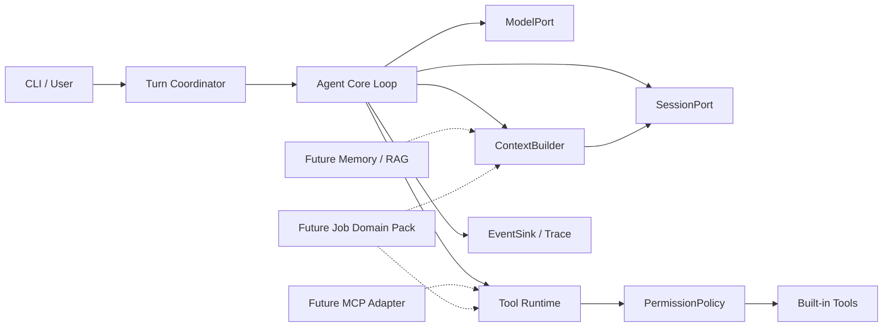

# Agent Runtime 架构

状态：`Proposed`

## 架构目标

JDAgent 先建设领域无关的 Agent Runtime，再通过独立领域包增加求职能力。第一阶段学习和验证通用机制；第二阶段验证这些接口能否承载真实的数据采集、检索、分析和评测需求。

```text
Job Agent
= Agent Runtime
+ Job Domain Tools
+ Job Knowledge and Retrieval
+ Job Workflows
+ Job-specific Evals
```

## 设计原则

- Agent Loop 保持小而稳定，复杂机制通过明确端口和服务组合。
- 领域策略依赖 Runtime 公共能力；Runtime 不依赖求职领域概念。
- 外部系统通过 Adapter 接入，Provider、存储和传输细节不进入 Core。
- Session Event 是历史事实；模型消息、CLI 输出和压缩结果都是投影。
- 每项机制必须可单独测试、观察失败并由学习者解释。
- 只为已批准需求增加抽象，不为假设中的未来框架预留空壳。

## 逻辑结构



## 模块职责

### Agent Core

- 驱动一次 Turn 的状态转换和终止判断。
- 只依赖项目领域类型和端口，不知道 CLI、DeepSeek、JSONL 或具体工具实现。
- 不直接组装 Provider 请求，不直接访问文件系统或环境变量。

### Model Gateway

- 定义 `ModelPort`、统一事件、能力声明和错误类别。
- 每个 Provider Adapter 负责协议转换、流解析和 Provider 异常映射。
- 首个真实 Adapter 是 DeepSeek；Fake Model 是测试依赖，不是特殊运行分支。

### Tool Runtime

- 维护工具身份、Schema、Handler 和风险信息的单一注册表。
- 统一执行查找、参数校验、权限、超时、结果转换和执行事件。
- 工具 Handler 不接触模型消息或 Agent Loop。

### Permission Policy

- 根据工具身份、参数、workspace 和风险输出 `ALLOW`、`ASK` 或 `DENY`。
- 审批由 CLI 等交互 Adapter 完成；Policy 不直接读取终端。
- 不可信工具声明不能扩大宿主机权限边界。

### Session

- 通过 `SessionPort` 追加和读取不可变事件。
- JSONL 是 v0.1 的存储 Adapter，不是领域模型。
- 会话恢复先重放事件，再生成上下文投影；不得从 CLI 文本猜测历史。

### Context Engine

- 将已选事件、System Prompt 和工具描述构造成 `ModelRequest`。
- v0.1 只做确定性投影和预算检查；压缩、记忆和 RAG 后续作为独立策略加入。
- 所有丢失信息的转换必须保留来源和可观察的触发原因。

### Observability

- 统一接收模型、工具、权限、会话和终止事件。
- 结构化 Trace 用于调试、学习、回归测试和后续 Eval。
- 日志是事件的消费端，不是另一份事实来源。

## 依赖方向

```text
CLI / Provider / Storage / Tool Adapters
                 ↓
Application Coordination
                 ↓
Agent Core + Domain Types + Ports
```

- Core 不得反向导入 Adapter。
- Provider SDK 类型只能出现在对应 Adapter 内。
- JSONL 路径和序列化格式只能出现在 Session Adapter 内。
- Job Domain Pack 只能通过公开端口和工具注册接口扩展 Runtime。

## v0.1 Turn 流程

1. CLI 将用户输入交给 Turn Coordinator。
2. Coordinator 追加用户消息事件，并调用 `ContextBuilder`。
3. Core 通过 `ModelPort` 消费流式 `ModelEvent`。
4. 文本事件进入 Trace；完整 Tool Call 交给 Tool Runtime。
5. Tool Runtime 校验参数并请求 Permission Policy。
6. `ASK` 通过交互端口等待用户决定；`DENY` 不执行 Handler。
7. 结果和权限决定追加到 Session，再开始下一次模型调用。
8. 模型正常结束、用户取消、错误或上限触发时记录稳定停止原因。

## 第二阶段扩展边界

求职能力以领域包接入，包含 Source Adapter、网页采集、正文解析、来源证据、去重、检索、职位匹配、面经分析和领域 Eval。任何网站特例、求职术语或领域 Prompt 都不得进入通用 Agent Core。

## 安全边界

- v0.1 不提供 Shell 和网络工具。
- 文件工具以解析后的 workspace 根路径为唯一边界，不接受字符串前缀判断。
- 校验和审批必须发生在副作用之前。
- API Key 不进入 Session、Trace 或异常正文。

