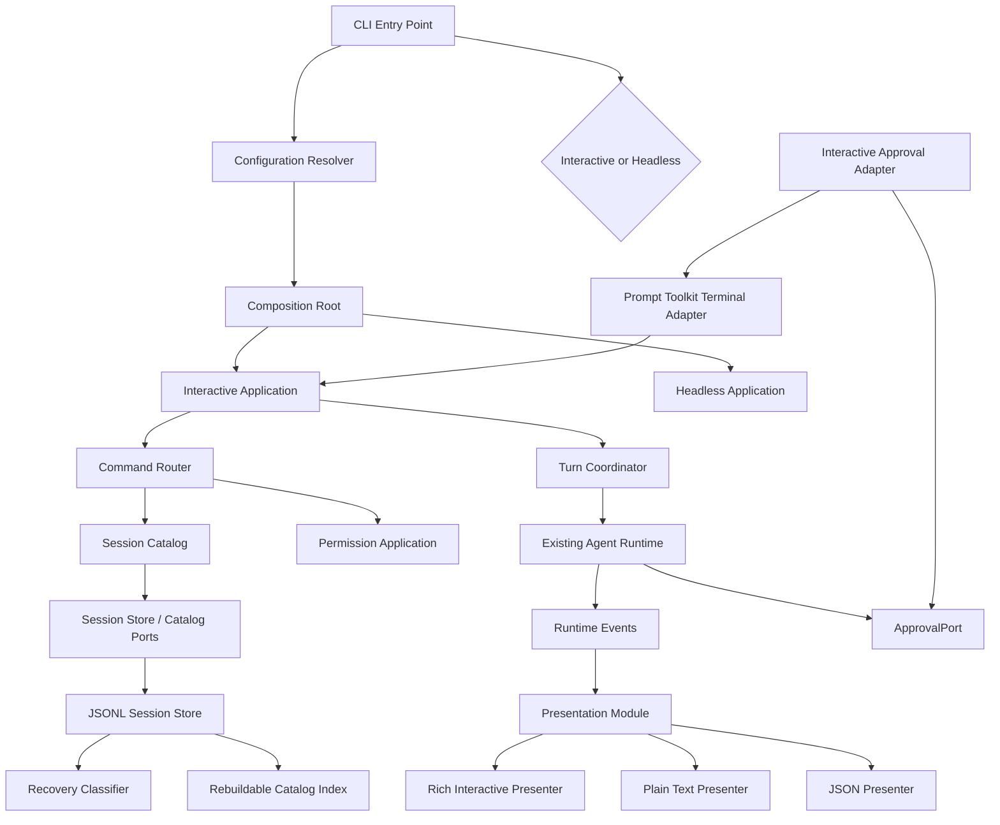

# CLI 应用层架构

状态：`Approved`

批准日期：2026-08-20

评审修订日期：2026-08-20（`REV-20260820-001`）

适用需求：[v0.2 CLI 体验需求](../requirements/v0.2-cli-experience.md)

相关决策：[ADR-0004：CLI 应用层与终端 Adapter](../decisions/ADR-0004-cli-application-layer.md)

## 架构目标

v0.2 在现有 Turn Coordinator 与 Agent Runtime 之外建立可安装、可测试的 CLI 应用层。CLI
应用层负责交互生命周期、命令、配置、Session 导航和呈现，但不复制 Agent Loop、权限策略、
事件历史或 Provider 逻辑。

本设计采用深模块原则：模块通过小接口隐藏终端、配置、索引和恢复复杂度；接口同时是调用方
与测试的观察面。不把“一个文件一个类”或“目录层级更多”当作模块化目标。

## 定义与边界

- **CLI 应用层**：交互模式和 Headless 模式共享的应用编排，不是 Agent Core。
- **Terminal Adapter**：Prompt Toolkit 输入能力与真实终端生命周期的具体实现。
- **Presenter Adapter**：Rich 交互呈现、纯文本或 JSON 输出的具体实现。
- **Session Catalog**：面向用例的 Session 发现、选择、命名与状态投影。
- **Recovery Classifier**：根据物理记录和 Runtime Event 前缀判断能否自动恢复。
- **UI 状态**：输入缓冲、光标、补全、Spinner 和当前交互阶段；不属于 Session 事实。
- **UserAction**：Terminal 提交给 Interactive Application 的封闭联合类型；v0.2 只包含
  `PromptAction | CommandAction | CancelAction | ExitAction`。

## 逻辑结构



依赖方向保持：

```text
Terminal / Presenter / Storage Adapters
                  ↓
CLI Application + Session/Configuration Use Cases
                  ↓
Turn Coordinator
                  ↓
Agent Core + Domain Types + Ports
```

## 主数据流

### 交互 Prompt

1. Terminal Adapter 把键盘输入转换为 `UserAction` 的 `PromptAction` 变体。
2. Interactive Application 检查当前状态允许开始 Turn。
3. Turn Coordinator 将 Prompt 追加为 Runtime Event 并驱动现有 Agent Loop。
4. Runtime Event 进入 Session Store 和 Presentation Module。
5. Rich Presenter 按事件显示流式文本、工具状态、审批和终止结果。
6. Turn 完成、失败或取消后，Interactive Application 回到 `IDLE`。

### 斜杠命令

1. Terminal Adapter 返回原始提交文本。
2. Command Router 把以 `/` 开头的输入解析为有类型 `CommandAction`。
3. Interactive Application 根据状态把命令交给 Session、Permission 或 Status 用例。
4. 命令结果转换为 UI 事件并呈现，不进入模型上下文。

### Tool Approval

1. Permission Policy 得出 `ASK` 并通过现有 `ApprovalPort` 发出请求。
2. Interactive Approval Adapter 将请求转换为安全 `ApprovalView`。
3. Terminal 展示工具、规范化目标、参数摘要、风险和允许范围。
4. 用户选择转换为 `ApprovalOutcome`；一次允许不带规则，Session 级允许带一条窄范围规则。
5. Permission 模块验证、持久化和匹配规则；Terminal 不维护旁路状态。

### Headless

1. CLI Entry Point 选择 Headless Application 和 text/json Presenter。
2. Headless Application 调用同一 Turn Coordinator，不建立第二套 Agent Loop。
3. stdout 只输出所选稳定格式；诊断与可执行错误写 stderr。

## 模块设计

### CLI Entry Point

外部接口保持为 `main(argv) -> int`。它只负责：

- 解析启动参数；
- 选择交互或 Headless 模式；
- 解析显式 workspace；
- 调用 Configuration Resolver 和 Composition Root；
- 把稳定结果映射为退出码。

它不得直接打开 Session 文件、渲染 Runtime Event、构造 Provider 或执行斜杠命令。

### Configuration Resolver

建议接口形状：

```python
resolve(workspace, cli_overrides) -> ResolvedConfiguration
```

内部隐藏用户/项目 TOML 路径、优先级、Schema、来源定位和安全字段限制。解析结果是不可变、已
验证配置；下游不再读取 TOML、环境变量或默认值。

配置文件是本地可替代依赖，测试使用临时目录即可；不为 TOML 解析器建立公共 Port。

### Interactive Application

建议外部接口只有一个高杠杆入口：

```python
run(startup_request) -> ExitStatus
```

内部状态机：

```text
STARTING
   ↓
IDLE ───────────────────────────► EXITING
   │
   ▼
RUNNING_TURN
   ├──► WAITING_APPROVAL
   ├──► RUNNING_TOOL
   ├──► CANCELLING
   └──► IDLE
```

内部状态名与 Presenter 的稳定 UI 标签一一对应，Presenter 不得自行推断另一套状态：

| Interactive Application 状态 | UI 标签 |
| --- | --- |
| `STARTING` | `starting` |
| `IDLE` | `idle` |
| `RUNNING_TURN` | `generating` |
| `WAITING_APPROVAL` | `waiting_approval` |
| `RUNNING_TOOL` | `running_tool` |
| `CANCELLING` | `cancelling` |
| `EXITING` | `exiting` |

它拥有当前 Session 引用、短暂交互状态和取消控制；不保存消息副本，不解释 JSONL，不判断
工具风险。运行中不允许 `/resume` 或 `/new`；用户必须先完成或取消当前 Turn。

### Terminal Module

终端接口以用户动作和展示模型为参数，不暴露 Prompt Toolkit 类型。建议最小能力：

```python
next_action(prompt_view) -> UserAction
publish(ui_event) -> None
request_approval(approval_view) -> ApprovalChoice
close() -> None
```

生产 Adapter 使用 Prompt Toolkit，测试 Adapter 使用预编排动作。`close()` 必须幂等并恢复
光标、颜色和输入模式。

### Command Router

Command Router 是 Interactive Application 的内部 seam，负责把文本解析成有类型命令并生成
统一帮助。v0.2 不把它提升为插件接口，也不让每条命令持有 Runtime 或存储 Adapter。

```text
/resume demo → ResumeCommand(selector="demo")
/rename work → RenameCommand(name="work")
```

未知命令和参数错误返回结构化使用错误，不创建 Turn。

### Session Catalog

Session Catalog 提供用例级接口，而非 JSONL 文件接口。调用方可以表达列出、解析选择器、命名
和获取状态；Catalog 内部隐藏 workspace 分区、短 ID、名称歧义、排序和索引重建。

建议将现有只负责 append/read 的 `SessionPort` 保持为 Runtime 窄接口，新增面向应用层的
Catalog seam。JSONL 生产 Adapter 与 InMemory/temporary 测试 Adapter 证明该 seam 有真实变化点。

Session 生命周期事实进入规范事件；Catalog 索引是可删除、可重建的投影。不得把文件名或独立
索引当作 Session 名称的唯一事实源。

### Presentation Module

Presentation Module 将 Runtime Event 和应用结果转换为 UI 语义，不改变事实：

```text
Runtime Event → Presentation Model → Rich / Text / JSON Presenter
```

交互 Presenter 可以维护流式换行和 Spinner 等短暂渲染状态；text/json Presenter 必须无 ANSI，
并严格分离 stdout 与 stderr。任何 Presenter 都不得影响 Session 写入或 Stop Reason。

### Approval Adapter

Interactive Approval Adapter 继续满足现有 `ApprovalPort`。它只负责将领域请求翻译为终端选择，
不自行决定 `ALLOW/ASK/DENY`，也不保存 Session 级权限旁路。Session Rule 必须由 Permission
模块规范化、持有和匹配。目标接口返回结构化 `ApprovalOutcome`，把本次决策与可选的
`SessionPermissionRule` 分开；Terminal 不构造规则。

Session Rule 是 Session 事实：授权后必须持久化，`/exit` 后恢复同一 Session 时继续有效，并且
可通过 `/permissions` 查看和撤销。用户配置的写权限上限是 `ASK | DENY`，项目配置只能从 `ASK`
收紧为 `DENY`；任何 Session Rule 都不得覆盖 `DENY`。

### Session Store 与 Recovery

Session Store 继续保证完整行写入、flush、`fsync` 和单 writer。v0.2 在其应用侧增加 Catalog
与 Recovery 能力，但 Core 不知道目录布局和修复策略。

恢复分成两轴：

| 物理状态 | 逻辑状态 | 行为 |
| --- | --- | --- |
| 完整 | 最后 Turn 已终止 | 正常恢复 |
| 最终半行 | 之前事件全部有效 | 备份、截尾、警告，再做逻辑分类 |
| 中间损坏/坏 Schema/坏 sequence | 任意 | fail closed |
| 完整 | 未完成且未越过副作用边界 | 追加进程中断失败事实后继续 |
| 完整 | 写副作用可能发生但结果缺失 | 阻止自动继续，保留原 Session，提供安全恢复出口 |

异常恢复 Session 只继承最后安全 Turn 之前的上下文，不回滚 workspace，不删除原 Session，
也不开放通用 branch 命令。其具体持久表示在实现该里程碑前通过契约测试和小型设计记录确定。

## 状态所有权

| 状态 | 唯一所有者 |
| --- | --- |
| 用户/模型消息、工具、权限请求、Turn 结果 | Runtime Event Log |
| Session 名称与生命周期 | Session 生命周期事件 |
| Session 列表和排序 | 可重建 Catalog 投影 |
| 当前交互阶段与取消控制 | Interactive Application |
| 输入缓冲、光标、补全和本地历史 | Terminal Adapter |
| Provider、模型、超时和预算 | Resolved Configuration |
| `ALLOW/ASK/DENY` 与 Session Rule | Permission Module |
| 颜色、Markdown、Spinner 和换行 | Presenter Adapter |
| Trace | Runtime Event 的安全投影 |

同一事实不得由两个模块独立持有。UI 状态不写入 Runtime Event；Session 事实不从终端文本反推。

## Workspace、配置与本机数据

```text
Target Workspace
└── .jdagent/config.toml       # 可选项目配置，不含秘密和放宽权限

OS User Config Directory
└── jdagent/config.toml        # 用户 Provider、Key 文件路径、权限上限、偏好

OS User Data Directory
└── jdagent/projects/<workspace-identity>/
    ├── sessions/
    ├── catalog-index
    └── input-history
```

workspace identity 使用唯一算法：

1. 对显式 workspace 或当前目录执行 `Path.resolve(strict=True)`，解析符号链接与 Windows junction；
2. 对结果执行 `os.path.normpath`，Windows 再执行 `os.path.normcase`；除文件系统根外去掉尾部分隔符；
3. 对规范路径的 UTF-8 字节计算 SHA-256，目录名固定为 `sha256-<64 位小写十六进制>`；
4. 每个分区保存含规范路径的 manifest；散列目录与 manifest 不一致时 fail closed；
5. workspace 移动或重命名后视为新 workspace，不自动合并旧分区。

平台路径由一个深的 `DataPaths` 模块隐藏，其他模块不得拼接环境变量：

| 平台 | 用户配置 | 用户数据 |
| --- | --- | --- |
| Windows | `%APPDATA%\\JDAgent\\config.toml` | `%LOCALAPPDATA%\\JDAgent\\projects\\<identity>\\` |
| Linux | `${XDG_CONFIG_HOME:-~/.config}/jdagent/config.toml` | `${XDG_DATA_HOME:-~/.local/share}/jdagent/projects/<identity>/` |
| macOS | `~/Library/Application Support/JDAgent/config.toml` | `~/Library/Application Support/JDAgent/projects/<identity>/` |

项目配置不得设置 Provider URL、Key 或 Key 文件。

v0.1 的 workspace 内 `.jdagent/sessions` 只读发现或导入必须非破坏性；迁移成功前不删除原文件。

## Headless 公共合同

模式判定只依赖参数，不读取 stdin 猜测意图：

| 位置参数 prompt | `--output` | 模式 |
| --- | --- | --- |
| 有 | 未指定 | Headless text |
| 有 | `text` | Headless text |
| 有 | `json` | Headless JSON v1 |
| 无 | 未指定 | Interactive |
| 无 | 任意值 | 使用错误，退出码 `2` |

v0.1 的可选位置参数 `prompt` 保留；v0.2 不增加仅为模仿其他 CLI 的 `-p` 别名。

稳定退出码如下：

| 退出码 | 语义 |
| --- | --- |
| `0` | `SUCCESS` |
| `1` | `INTERNAL_ERROR`：未分类内部错误 |
| `2` | `USAGE_OR_CONFIG_ERROR`：参数或配置无效 |
| `3` | `SESSION_ERROR`：Session 不存在、损坏或不可恢复 |
| `4` | `RUNTIME_ERROR`：Provider、Tool 或 Turn 失败 |
| `130` | `CANCELLED`：进程级用户取消 |

交互模式中单个 Turn 失败只呈现错误并回到 prompt；`/exit`、idle EOF 正常退出为 `0`，idle
`Ctrl+C` 退出为 `130`。

`--output json` 的 v1 stdout 是一个 JSON 对象，必须包含：

```json
{
  "schema_version": 1,
  "status": "success",
  "session_id": "...",
  "turn_id": "...",
  "stop_reason": "completed",
  "answer": "...",
  "provider": "deepseek",
  "model": "...",
  "usage": {"input_tokens": 0, "output_tokens": 0, "total_tokens": 0},
  "error": null
}
```

失败时 `error` 是净化后的结构化对象而非 traceback。`--show-trace` 在 text 模式写安全 trace 到
stderr；在 JSON 模式可增加安全的 `trace` 字段，不改变必需字段。

v0.1 启动参数按以下规则兼容：

| 参数 | v0.2 合同 |
| --- | --- |
| `prompt` | 保留，选择 Headless |
| `--session-id` | 保留，用于 Headless 显式恢复 |
| `--provider` | 保留；默认 `deepseek`，显式 `fake` 不读取 Key |
| `--model`、`--base-url` | 保留为 CLI 覆盖值 |
| timeout、budget、`--workspace` | 保留 |
| `--data-dir` | 保留为专家/测试覆盖，不再作为默认 workspace 内目录 |
| `--show-trace` | 保留，遵守 stdout/stderr 与 JSON 规则 |
| `--fake-delay` | 仅 `fake` Provider 合法，否则配置错误 |
| `--output` | 新增，仅 Headless 合法 |
| `--version` | 新增，从已安装包元数据读取 |

## 终端依赖

- Prompt Toolkit：多行、历史、搜索、补全、快捷键、动态状态栏和异步终端输入。
- Rich：角色、Markdown、工具状态、审批、警告和错误呈现。
- 两者只能位于 CLI Adapter 包；Core 和应用用例只接触项目定义的用户动作与展示模型。
- Scripted Terminal 和 Capture Presenter 是一等测试 Adapter，不是测试专用旁路。
- M6 开始前必须批准 Windows 终端附录，固定 ConPTY、legacy console、重定向、IME、`Ctrl+C`、
  EOF、颜色降级和窄窗口的行为与手动测试矩阵。

## 安全约束

- Workspace 默认当前目录且不自动上探 Git 根，避免静默扩大工具范围。
- 项目配置只能设置安全字段和收紧权限；未知或禁止字段明确失败。
- DeepSeek Key 只在 Composition Root 解析，Adapter 只接收值；Presenter 永不接收秘密来源对象。
- Session 级允许使用规范化目标和最小范围；Terminal 不解释路径包含关系。
- 副作用结果不确定时不自动重试、不伪造 Tool Result、不让模型继续。
- Session 修复保留原始证据，并在 UI、Trace 或恢复元数据中可观察。

## 外部参考规则

[claude-code-best/claude-code](https://github.com/claude-code-best/claude-code) 和 Anthropic 官方
Claude Code 文档是非规范性参考，用于观察成熟交互流程、职责分离和失败处理。它们不是项目事实
来源、兼容目标或默认答案。

使用规则：

1. 先从 JDAgent 已批准需求、Python 技术栈和现有 Runtime 契约推导设计。
2. 当可维护性、模块职责或交互行为存在疑问时，对照具体外部 revision 或文档页面。
3. 记录借鉴的原则与本项目取舍，不使用“Claude 就是这样”代替证据。
4. 不复制或移植无清晰兼容许可证的源码、命名或目录结构。
5. 外部项目变化不自动改变 JDAgent；任何长期约束仍需项目 ADR 或批准文档。

## 测试 seam

- Terminal：Prompt Toolkit Adapter 与 Scripted Terminal Adapter。
- Presentation：Rich、Plain Text、JSON 与 Capture Presenter。
- Model：DeepSeek 与现有 Fake Model。
- Session/Catalog：JSONL 与 InMemory/temporary Adapter。
- Configuration：真实临时目录，不为 TOML 创建多余 Port。
- 进程生命周期：真实子进程加确定性故障同步点。

测试通过相同接口观察行为，不穿透模块验证私有状态。详细阶段与退出条件见
[v0.2 实施计划](../plans/v0.2-cli-implementation.md)。

## 延后边界

全屏 TUI、自定义命令、Skills、Hooks、Plugins、shell、MCP、Subagent、后台任务、通用 Branch、
Checkpoint、Undo、自动 compact、`stream-json`、新增 Provider 与完整 Project Trust 系统均不进入
本架构的 v0.2 实现范围。
