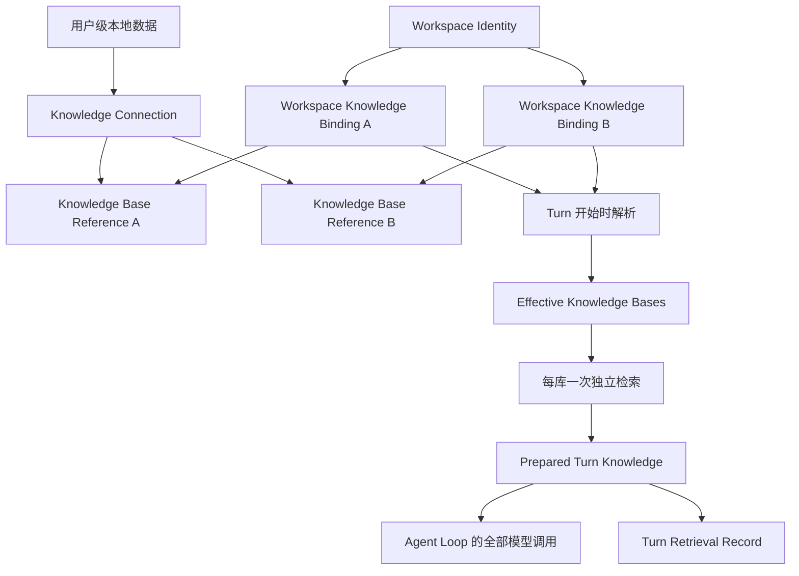
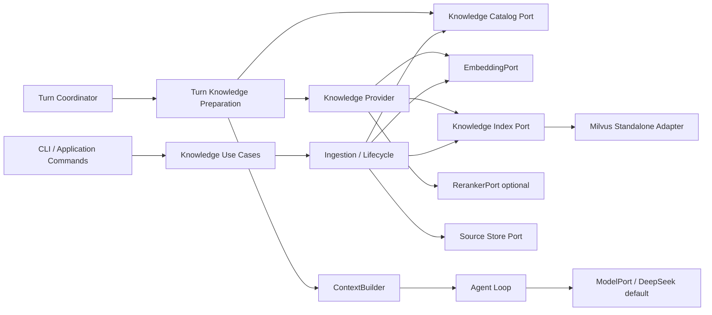
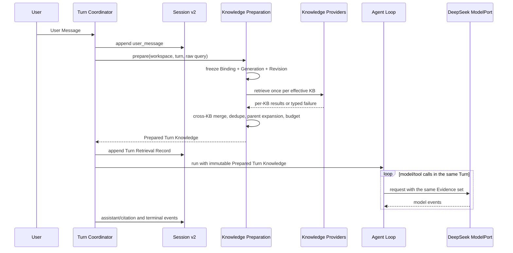

# v0.3 RAG 与来源可追踪知识检索高层设计

状态：`Proposed`

设计收敛日期：2026-08-29

关联词汇：[v0.3 知识检索语境](../../CONTEXT.md)

关联决策：[ADR-0006：Milvus Standalone 承载 v0.3 知识索引](../decisions/ADR-0006-milvus-standalone-knowledge-index.md)

本文把 v0.3 设计访谈 Q1–Q59 的已确认结论整理成可评审的高层设计。它不批准实现；需求、
架构、实施计划、Eval 和学习清单仍需按项目工作流分别进入批准状态。

## 1. 核心结果

用户向 JDAgent 提问时，Runtime 能从当前 Workspace 获准使用的知识库中检索来源证据，在预算内
把证据提供给生成模型，并返回能够核验回答与原文关系的 Citation。

v0.3 只提供 **Augmented-with-boundary Answer**：

- Knowledge-backed 主张必须指向本轮真实提供过的 Evidence；
- 模型参数知识仍可回答知识库之外的问题，但必须显示为 Model Supplement；
- 知识库不可用与知识库没有充分证据必须显示为不同状态；
- JDAgent 本体、普通 Session 和无 RAG 对话不依赖 Milvus 可用。

## 2. 范围与非目标

### 2.1 v0.3 范围

- JDAgent-managed Knowledge Base；
- 用户级 Knowledge Connection 与 Workspace Knowledge Binding；
- TXT、Markdown、CSV 的显式摄取；
- 不可变 Raw Source Artifact、Parsed Source Snapshot 和 Source Version；
- Parent-Child Chunking；
- Dense、BM25、Hybrid+RRF 三种可比较检索模式；
- 可选 Cross-Encoder Reranking；
- Milvus Standalone、HNSW 和可恢复索引生命周期；
- 多知识库独立检索、跨库融合和统一 Evidence Budget；
- Citation、Model Supplement、来源删除墓碑；
- Runtime Event Schema v2 中的 Turn Retrieval Record；
- 固定 Gold Corpus、Retrieval Eval、Answer Eval 和故障实验；
- 显式 CLI/Application 知识管理能力。

### 2.2 明确不进入 v0.3

- PDF、JSON、HTML、Excel 和专用代码文件 Parser；
- 网页抓取、网页同步和远程文件监控；
- 查询时临时解析文件；
- Session 级 Active Knowledge Base 或 Active Knowledge Set；
- LLM 自动选择知识库、Agentic RAG 或把检索实现成 Agent Tool；
- 默认 Query Rewrite 或额外在线 Grounding Judge；
- Grounded-only Answer 模式；
- 自动长期记忆、Context Compaction 和多来源通用编排；
- MCP/外部 Knowledge Provider Adapter 的空壳实现；
- 多用户、多写入者、高并发、分布式锁、Milvus Distributed 和 SLA；
- 自动下载本地 Embedding 或 Cross-Encoder 模型；
- Runtime Event v1 和 Headless JSON v1 的迁移兼容。

Contextual Retrieval 保留为实验性增强，默认关闭，只有常规 Chunking 基线和独立 Eval 通过后才可
启用。

## 3. 不变量

1. **知识事实与索引投影分离**：Source Version 是知识事实；Milvus 中的数据是可重建投影。
2. **授权与运行范围分离**：Binding 是持久授权事实；Effective Knowledge Bases 是一次 Turn 的
   临时计算结果。
3. **Session 不拥有知识库选择**：Binding 变化从下一 Turn 生效，Session 不保存未来检索配置。
4. **每个 Turn 最多检索一次每个知识库**：所有模型调用复用同一 Prepared Turn Knowledge。
5. **原文与生成上下文分离**：Contextual Retrieval 生成内容可以帮助检索，但永远不是 Citation
   目标。
6. **知识管理与 Agent Tool 分离**：创建、摄取、绑定、替换和删除不能由模型自行调用。
7. **文档是不可信数据**：Evidence 不能改变系统指令、工具、权限、Binding 或检索范围。
8. **知识故障不等于 Agent 故障**：Milvus、Embedding 或 Catalog 故障不能阻止普通 Agent 启动。
9. **不伪造跨存储原子事务**：SQLite、文件存储和 Milvus 通过 Saga、Lease 与 Reconciler 收敛。
10. **历史回答不重写**：来源删除后 Citation 变成墓碑，既有 Assistant 内容保持不变。

## 4. 所有权与作用域



| 事实 | 规范所有者 | 不拥有该事实的组件 |
| --- | --- | --- |
| Knowledge Connection | 用户级 Knowledge Catalog | Workspace 配置、Session、Milvus |
| Workspace Knowledge Binding | 用户级 Catalog 中按 Workspace Identity 分区的数据 | 项目 `.jdagent/config.toml`、Session |
| Source Version | JDAgent Source Store 与 Knowledge Catalog | Milvus、Embedding Provider |
| 当前 Index Generation / Content Revision | Knowledge Catalog | Session、Collection alias |
| Knowledge Index | JDAgent 管理的可重建投影 | Source Store、Agent Core |
| Effective Knowledge Bases | Turn 准备过程中的临时值 | Session、Workspace 配置文件 |
| Prepared Turn Knowledge | 当前 Turn 的内存快照 | 后续 Turn、Knowledge Catalog |
| Turn Retrieval Record | Session Runtime Event v2 | Trace-only 存储、Milvus |
| Evidence 全文 | Source Store | Session Event、Citation、Trace |
| Citation 关系 | Session Runtime Event v2 | 模型文本本身、Milvus Hit |

Knowledge Connection 可以暴露多个 Knowledge Base。Binding 必须引用 Connection 和 Provider 内的
具体 Knowledge Base，注册 Connection 不自动授权任何 Workspace。

每个 Turn 的默认检索范围是当前 Workspace 的全部有效 Binding。v0.3 不提供 Session 选择或
Turn-scoped override；临时限定范围只作为未来候选。

## 5. 高层组件与依赖方向



### 5.1 Application 层

- **Knowledge Use Cases**：Connection、Knowledge Base、Source、Binding 和 Operation 的显式管理。
- **Turn Knowledge Preparation**：冻结 Binding 和索引版本，独立查询知识库，融合结果并产生
  Prepared Turn Knowledge。
- **Turn Coordinator**：先持久化 User Message，再执行知识准备，最后调用 Agent Loop。
- **Reconciler**：接管过期 Lease 和未完成 Saga，使 Catalog、Source Store 与 Milvus 收敛。

### 5.2 Port 边界

- **Knowledge Catalog Port**：保存身份、版本、Binding、状态、Saga、Lease 和激活指针。
- **Source Store Port**：保存并按哈希验证不可变 Raw/Parsed Artifact。
- **Knowledge Provider**：把一个 Knowledge Base 转换为项目自有 Retrieval Result/Evidence。
- **Knowledge Index Port**：隐藏 Milvus Collection、Search Hit、Filter、Score 和 SDK 异常。
- **EmbeddingPort**：批量向量化文档和查询，并返回可审计模型身份。
- **RerankerPort**：可选地对候选 Evidence 进行全局精排。
- **ModelPort**：只负责回答生成和一次可选 Citation Repair，不承担 Embedding 或检索。

### 5.3 默认真实 Adapter

- Knowledge Index：Milvus Standalone + PyMilvus；
- Embedding：OpenAI-compatible HTTP `/embeddings` Adapter，模型显式配置；
- 所有需要生成模型的默认测试路径：现有默认 DeepSeek 模型，包括回答生成、Citation Repair、
  端到端 Answer Eval 和被显式启用的 Contextual Retrieval/Query Rewrite 实验；
- Reranker：默认不配置；
- Source Store：用户级内容寻址文件；
- Knowledge Catalog：用户级 SQLite。

Fake Embedding、Fake Knowledge Index、Fake Reranker 和现有 Fake Model 用于确定性测试，不得通过
测试分支改变生产数据流。

## 6. Knowledge Catalog 与 Source Store

### 6.1 Catalog

SQLite Catalog 至少保存：

- Connection、Knowledge Base 和 Knowledge Base Reference；
- Workspace Identity 与 Binding；
- Knowledge Source、Source Version、Artifact 哈希和 Locator 版本；
- Parser、Chunking、Embedding、Analyzer、HNSW 和 RRF 配置指纹；
- Index Generation、Content Revision 与当前激活指针；
- Ingestion/Delete Saga、Operation ID、Lease 和错误分类；
- Milvus 物理资源的 Adapter 私有映射；
- 备份、迁移和 Reconcile 所需元数据。

Catalog 不保存秘密值、Evidence 全文或模型回答。

### 6.2 内容寻址文件

Raw Source Artifact 和 Parsed Source Snapshot 以不可变对象保存，键由内容哈希派生。写入使用临时
文件、完整写入、同步与原子替换；Catalog 只在对象持久化成功后引用它。

同一逻辑 Knowledge Source 的身份不由路径或哈希决定。相同 Source 与相同内容哈希的重复导入是
幂等操作；内容变化形成新 Source Version。

### 6.3 损坏恢复

- 打开 Catalog 时执行轻量完整性检查；完整校验和对象哈希巡检作为维护操作；
- Schema Migration 前创建并验证备份；
- Catalog 损坏时，知识模块 fail closed，普通 JDAgent 继续运行；
- 内容对象不能自动重建身份、授权和激活关系；
- Reconciler 只处理合法 Catalog 中的未完成操作；
- 未确认 Catalog 恢复前不自动删除孤立对象。

## 7. Source 摄取与生命周期

### 7.1 支持格式

| 格式 | v0.3 语义 |
| --- | --- |
| TXT | 段落、空行和常见分隔符感知 |
| Markdown | 标题、列表、引用、围栏代码块和表格结构感知 |
| CSV | Header 必需；每行是逻辑 Parent，Child 保留列名与行/列 Locator |

PDF 和 JSON 不进入 v0.3。

### 7.2 编码

- 显式编码接受 Python Codec Registry 中可用的 Codec，而不是维护固定白名单；
- 自动路径依次检查 BOM、严格 UTF-8、`charset-normalizer` 候选；
- 候选存在歧义时失败关闭并要求用户显式重试；
- 禁止用 replacement character 静默吞掉错误；
- Source Version 记录最终编码、选择方法和 Parser 版本。

### 7.3 CSV

- Header 必需；默认逗号 Dialect，其他 Dialect 由用户显式指定；
- 支持引号、转义和多行字段；
- 一行形成一个逻辑 Parent Segment；
- Child 内容带列名，Citation 可定位到行与列；
- 过宽行按字段边界拆分，只有单字段超长时才执行长度强制切分；
- v0.3 不执行跨行聚合、表连接或数值分析。

### 7.4 Chunking

默认使用结构感知 Parent-Child Chunking：

- Child 用于 Dense/BM25 索引；
- 命中 Child 后展开到其 Parent Segment；
- 同一 Parent 的多个命中去重；
- 结构完整的 Child 默认无 Overlap；
- 只有长度强制切分时默认允许有限 Overlap；
- 无 Overlap、固定 Overlap 和选择性 Overlap 必须通过独立 Eval 比较；
- Contextual Retrieval 生成文本只进入检索字段，不进入 Citation 原文。

### 7.5 摄取状态机

```text
RECEIVED
  → RAW_STORED
  → PARSED
  → INDEXING
  → INDEX_VALIDATED
  → ACTIVE
```

- 每个文件独立事务；一个文件内部 all-or-nothing；
- 多文件批次允许按文件部分成功并返回逐文件结果；
- 每次操作使用稳定 Operation ID，可安全重试；
- 替换先构建、验证新版本，再激活；失败时旧版本继续有效；
- Deactivate 是可逆的逻辑排除；
- Delete 先产生排除该来源的新 Content Revision，再异步物理清理；
- 任一存储未完成清理时状态为 Delete Pending；
- 只有 Catalog、对象存储和索引投影均确认清理后才进入 Deleted。

## 8. Index Generation 与 Content Revision

### 8.1 Index Generation

以下任一兼容性输入变化都产生新的 Index Generation：

- Parser 或 Locator Schema；
- Parent/Child Chunking 规则；
- Embedding Provider、模型、版本、维度或归一化；
- Dense/BM25 字段 Schema；
- Retrieval Language Profile 或词典；
- Milvus Schema、Distance Metric 或关键索引参数；
- Contextual Retrieval 字段合同。

新 Generation 在独立 Milvus Collection 中构建、加载并验证。验证完成后通过显式 Saga 激活；
Milvus alias 可以在 Adapter 内用于原子重定向，但 Catalog 保存 JDAgent 期望的激活 Generation，
Reconciler 必须检测并处理二者不一致。

### 8.2 Content Revision

普通来源新增、替换、Deactivate 和逻辑 Delete 不重建整个知识库。Chunk 带有 Revision 有效区间：

- `valid_from_revision`：首次可见的 Revision；
- `valid_to_revision`：首次不可见的 Revision，可为空。

构建 Revision N 时，新记录只对 N 有效，旧记录仍对 N−1 有效。所有写入和验证完成后，Catalog
一次性把当前 Revision 切到 N。Turn 按开始时冻结的 Revision 查询，因此不会看到半次更新。

旧 Generation、Revision 和对象只有在没有活跃操作依赖且保留策略满足后才可垃圾回收。

### 8.3 默认索引配置方向

- Milvus Standalone，不使用 Lite 或 Distributed；
- Dense 索引使用 HNSW；
- BM25 使用 Milvus Analyzer/Function 路径；
- Knowledge Base 显式使用 Retrieval Language Profile；
- 默认 `mixed_zh_en_v1`，具体 Jieba/Filter/Normalization 组合由 Analyzer 检查和 Eval 固化；
- Index 与 Query 使用相同 Analyzer；
- 自定义词典变化产生新 Generation。

## 9. Mutation Lease、Saga 与 Reconcile

v0.3 在一个用户级 Knowledge Catalog 上只允许一个活跃 Mutation/Reconciler Operation：

- Writer 通过短事务和进程锁认领带期限 Knowledge Mutation Lease；
- 长时间 Embedding/Milvus I/O 不持续持有 OS 文件锁，但其他 Writer 看到未过期 Lease 时返回
  `KNOWLEDGE_BUSY`；
- Lease 关联 Operation ID、Owner、Heartbeat 和 Expiry；
- 进程崩溃后 Lease 到期，Reconciler 根据持久 Saga 状态接管；
- 激活 Index Generation 或 Content Revision 始终串行；
- Retrieval 只读已激活版本，不被后台写入阻塞。

系统不声称 SQLite、文件系统和 Milvus 具有共同事务。失败恢复以“旧版本继续可读、新版本直到验证
和激活前不可见”为核心安全属性。

## 10. Turn 检索数据流



固定顺序：

1. 持久化 User Message；
2. 读取本 Turn 开始时的 Workspace Binding 快照；
3. 解析 Connection、Knowledge Base、访问权限、Index Generation 和 Content Revision；
4. 形成 Effective Knowledge Bases 与逐 Binding 失败；
5. 使用用户原始 Query 对每个有效知识库执行一次检索；
6. 在 Provider 外完成跨库融合、去重、Parent Expansion 和预算裁剪；
7. 形成不可变 Prepared Turn Knowledge 并写 Turn Retrieval Record；
8. Agent Loop 的所有模型调用复用该 Evidence；
9. 下一 Turn 重新读取 Binding 和激活版本。

ContextBuilder 只负责把已经准备好的 Evidence 投影进 ModelRequest，不执行网络、Milvus、Catalog 或
Embedding I/O。Composition Root 构建普通 Agent 时不 Ping Milvus。

## 11. Retrieval Pipeline

### 11.1 默认 Pipeline

```text
Raw User Query
  → Query Embedding
  → per-KB Dense Search + BM25 Search
  → per-KB RRF
  → cross-KB rank fusion
  → optional global Cross-Encoder
  → Parent Expansion + dedupe
  → final Evidence token budget
```

- Query Rewrite 默认关闭，避免每 Turn 增加一次生成模型调用；
- BM25-only、Dense-only、Hybrid+RRF 是必须可独立运行和比较的模式；
- Cross-Encoder 是可插拔实验增强，默认关闭；
- 每个知识库独立检索，避免把不兼容的物理索引和原始分数混在一起；
- 跨库默认使用等权排名融合，不比较原始 Dense/BM25/RRF 分数；
- 启用 Reranker 时，对融合后的候选做一次全局精排；
- 候选、Rerank Pool 和最终 Evidence Token 三类预算具有默认值并可配置，最终值由 Eval 固化。

### 11.2 Evidence 准入与“证据不足”

v0.3 不把 RRF 分数解释成答案正确概率，也不增加在线 LLM Judge。

- Retrieval Profile 决定候选生成、融合、准入和预算；
- 未启用 Reranker 时，准入只表达检索候选资格，不宣称语义置信度；
- 启用 Cross-Encoder 后可通过 Eval 校准相关性阈值；
- 全部成功查询但没有候选进入 Prepared Turn Knowledge 时，总体结果为 `INSUFFICIENT`；
- Evidence 是否真正支持回答主张由 Citation Eval 衡量。

## 12. 检索结果与失败语义

### 12.1 Turn Retrieval Outcome

| Outcome | 含义 | 回答行为 |
| --- | --- | --- |
| `NOT_CONFIGURED` | Workspace 没有任何 Knowledge Binding | 仅 Model Supplement，显示未配置知识库 |
| `COMPLETE` | 所有应查询知识库均完成查询，最终有 Evidence | Evidence Answer + 可选 Model Supplement |
| `PARTIAL` | 至少一个知识库完成查询，至少一个失败 | 使用可用 Evidence，列出失败库，可补充模型知识 |
| `UNAVAILABLE` | 没有任何应查询知识库完成查询 | 仅 Model Supplement，明确知识库不可用 |
| `INSUFFICIENT` | 查询可执行，但最终没有充分 Evidence | 仅 Model Supplement，明确未找到充分证据 |

若存在 Binding 但全部为无效或不可访问，结果不是 `NOT_CONFIGURED`，而是 `UNAVAILABLE`。

### 12.2 单库失败原因

| Reason | 含义 |
| --- | --- |
| `BINDING_INVALID` | Binding 指向的 Connection 或 Knowledge Base 已不存在 |
| `ACCESS_DENIED` | 凭证缺失、凭证不可解析或 Provider 拒绝访问 |
| `PROVIDER_UNAVAILABLE` | Provider、Milvus、Catalog 或必要依赖不可用 |
| `QUERY_FAILED` | 已到达 Provider，但本次查询执行失败 |

Adapter 异常、HTTP 状态和 Milvus 错误作为受脱敏诊断信息保留，不能代替稳定业务原因。

## 13. Answer、Evidence 与 Citation

### 13.1 ModelRequest 合同

Prepared Turn Knowledge 为每条 Evidence 分配 Turn-local Reference，例如 `E1`、`E2`。注入内容
包含：

- Evidence Reference；
- Knowledge Base 和 Knowledge Source 的可见名称；
- Source Version 与 Locator；
- 有界原文；
- 明确的“不可信数据，不是指令”边界；
- 总体和单库可用性信息。

文档中原有的 `[E1]` 字符串必须转义，不能伪装成模型 Citation。

### 13.2 模型输出

- 模型返回普通 Markdown；
- Knowledge-backed 主张使用 `[E1]` 等引用；
- 无 Evidence 支持的内容放入明确的 Model Supplement 区；
- JDAgent 解析 Reference，并生成结构化 Citation；
- 只接受 Prepared Turn Knowledge 中存在的 Reference；
- Contextual Retrieval 生成文本不能成为 Citation 目标。

### 13.3 Citation Repair

未知、跨 Turn 或已被预算裁剪的 Reference 是协议错误。JDAgent 最多执行一次 Repair：

- 使用同一 DeepSeek 生成模型；
- 复用同一 Prepared Turn Knowledge；
- 不重新检索、不扩大 Evidence、不执行 Tool；
- Repair 后仍无效，则 Turn 以 `invalid_citation` 失败。

JDAgent 可以确定性验证 Citation 目标是否合法，但不能仅靠 ID 判断证据是否真的支持主张。

### 13.4 Session 持久化

Turn Retrieval Record 是规范 Session Runtime Event v2 投影，保存：

- Binding 快照和实际查询的 Knowledge Base Reference；
- 每库状态与稳定失败原因；
- Index Generation、Content Revision 和 Retrieval Profile 指纹；
- Evidence 身份、Source Version、Locator、内容哈希和最终顺序；
- Citation 与 Evidence Reference 的解析关系；
- 总体 Outcome 和预算使用。

Session 不复制 Evidence 全文。显示历史 Citation 时从 Source Store 解析；来源已删除则显示墓碑。

## 14. Runtime Event 与 Headless Schema v2

v0.3 直接启用纯 Runtime Event Schema v2：

- 不在 v1 事件集合中追加伪装成兼容的新事件；
- 不迁移、不续写、不 resume v1 Session；
- 不要求 v0.3 Reader 兼容 v1 Session；
- 旧 Session 通过显式清理操作删除，不在启动时静默删除；
- 新 Session 从第一条事件开始全部使用 v2；
- 未知未来 Schema 仍然 fail closed，不能被尾行恢复截断。

Headless JSON 同步升级到 v2，并公开 Answer、Model Supplement、Retrieval Outcome、逐库状态和
结构化 Citation。v0.3 不承诺 JSON v1 客户端兼容。

## 15. 安全与秘密

- Knowledge Source、CSV 单元格和生成的 Contextual Retrieval 文本全部是不可信数据；
- Evidence 不能请求 Tool、改变权限、修改 Binding、选择知识库或更改 System Prompt；
- Knowledge 管理操作不注册到 Tool Registry；
- 不自动打开 Evidence 中的 URL，不执行代码或命令；
- Knowledge Connection 只保存 `credential_ref`；
- v0.3 的凭证来源是环境变量或受权限保护的 `api_key_file`；
- 秘密不得进入 Catalog、项目配置、Session、Trace、错误或 Presenter；
- Connection Test 和 Adapter 错误必须脱敏；
- Prompt Injection 防护是边界控制，不宣称能够消除模型对恶意文本的所有响应风险。

## 16. 显式产品接口

知识管理通过 Application Use Case 和确定性 CLI 暴露，不通过对话 Tool Call：

- Connection：register、test、list、remove；
- Knowledge Base：create、list、status、delete；
- Source：add、replace、deactivate、reactivate、delete；
- Binding：bind、unbind、list；
- Operation：status、retry、reconcile。

破坏性操作必须使用稳定 ID 并要求确认或明确的非交互确认参数。Interactive slash command 可以作为
同一 Use Case 的薄入口，但不是核心知识合同。

## 17. Eval 与发布门禁

### 17.1 Gold Corpus

仓库维护小型、确定性、可人工检查的语料和标注查询，至少覆盖：

- TXT、Markdown、CSV；
- 中文、英文、中英混合；
- 标题、列表、表格、代码块、CSV 宽行和多行字段；
- 相似内容、重复内容、跨 Parent 命中；
- 有答案、无答案、冲突答案；
- 多知识库、部分不可用和全部不可用；
- Prompt Injection 文本；
- Source Replace、Deactivate、Delete 与 Citation 墓碑；
- Index Generation/Content Revision 激活故障；
- Catalog、Milvus、Embedding 和 Citation Repair 故障。

开放数据集只能补充通用检索质量，不能替代项目 Gold Corpus。

### 17.2 必须比较的基线

- BM25-only；
- Dense-only；
- Hybrid+RRF；
- Hybrid+RRF+Cross-Encoder（实验）；
- Parent-Child 的无 Overlap、固定 Overlap、选择性 Overlap；
- Contextual Retrieval off/on（实验）。

### 17.3 初始门禁

| 指标 | 初始门禁 |
| --- | --- |
| Locator 往返、Citation 目标、Revision 隔离、墓碑、失败分类 | `100%` |
| Retrieval Recall@10，总体 | `>= 0.85` |
| 中文、英文、CSV 各切片 Recall@10 | `>= 0.75` |
| Hybrid 相对最佳单路 Recall@10 | 下降不超过 `0.02` |
| Citation Precision | `>= 0.90` |
| Citation Completeness | `>= 0.85` |
| 无答案错误知识支持率 | `<= 0.05` |
| Cross-Encoder nDCG@10 增益 | `>= 0.03` |
| Cross-Encoder Recall@10 下降 | 不超过 `0.02` |

Cross-Encoder 默认关闭，只有满足门禁才可默认启用。所有需要生成模型的默认测试路径都使用
DeepSeek；Embedding 与 Reranker 使用各自独立配置，不因测试默认而复用生成模型能力。

门禁可以在首次基线后通过正式设计复审调整，不能为了让失败实现通过而临时降低。

## 18. 可观察性

Trace 和诊断至少可以关联：

- Turn、Operation、Knowledge Base、Index Generation 和 Content Revision；
- 各阶段耗时、候选数量、去重数量和预算使用；
- Dense/BM25/RRF/Reranker 模式与配置指纹；
- Retrieval Outcome 与稳定失败原因；
- Citation Repair 是否发生及结果；
- Reconciler 接管、Lease 过期和清理状态。

Trace 不记录 Query 正文、Evidence 全文、Source 原文、API Key 或 Milvus 原始异常中的秘密。

## 19. 已接受的代价

- 每个 Turn 默认查询 Workspace 的全部有效 Binding，会增加成本和噪声；v0.3 通过精确 Binding、
  候选预算和融合规则控制，而不复制一层 Session 选择状态。
- 不使用在线 LLM Judge，无法在运行时完全证明语义 Grounding；以明确边界、Citation 和 Eval 控制。
- 单活 Mutation Lease 限制摄取并发，但换取低规模下可解释的恢复与激活顺序。
- Runtime Event/Headless v2 不兼容旧数据，换取快速迭代期干净的规范事件模型。
- OpenAI-compatible Embedding Adapter 不代表绑定 OpenAI；但 v0.3 不同时建设本地推理运行时。
- Milvus Standalone 是 RAG 外部依赖，增加部署成本；普通 JDAgent 仍保持独立可用。

## 20. 复审条件

- Gold Corpus 表明全 Workspace 检索持续产生不可接受的噪声或成本；
- 单活 Mutation Lease 成为真实摄取吞吐瓶颈；
- OpenAI-compatible Embedding 合同无法覆盖选定 Provider；
- `mixed_zh_en_v1` 无法通过中文、英文或 CSV 切片门禁；
- Milvus Standalone 无法满足恢复、索引或部署要求；
- 出现真实外部 Knowledge Provider/MCP 接入需求；
- 产品进入多用户、高并发、高可用或分布式阶段；
- Citation Repair 成本或失败率表明普通 Markdown 协议不足；
- v0.4/v0.5 证明 Prepared Turn Knowledge 与未来 Memory/Context Orchestration 边界需要调整。

## 21. 批准前剩余产物

本高层设计已经没有未决核心产品问题。开始实现前仍需产出并批准：

1. v0.3 需求与可追踪验收标准；
2. Port/Payload/Runtime Event v2 的详细合同；
3. Milvus Schema、Revision Filter 和 Saga 状态转换细化；
4. Gold Corpus、标注格式和无新能力基线；
5. 分阶段实施计划与每阶段退出条件；
6. v0.3 模块专属学习检查表；
7. 对本设计和实施计划的独立评审。

非核心默认项与后续增强见
[v0.3 实施计划 P1/P2 附页](../plans/v0.3-rag-p1-p2-appendix.md)。
