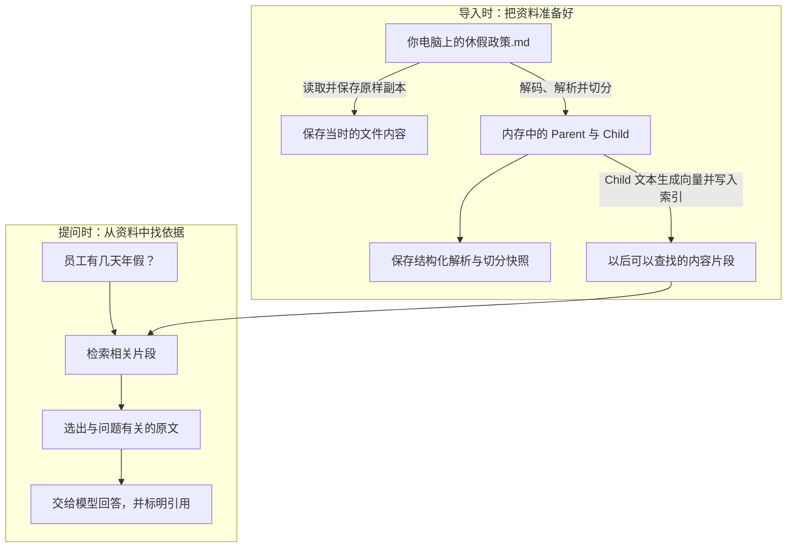
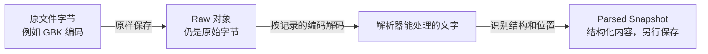
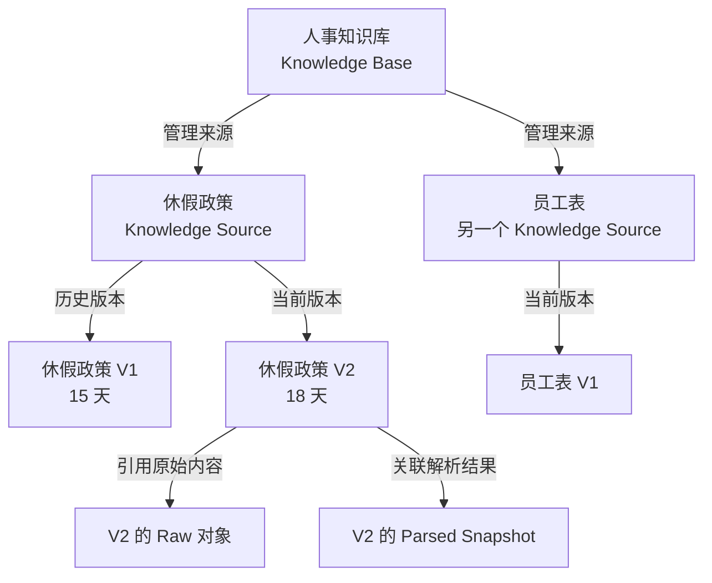
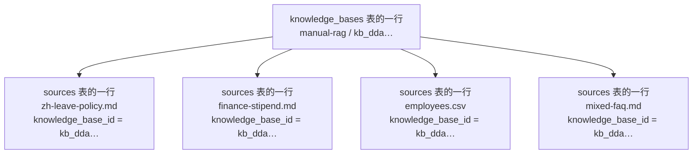
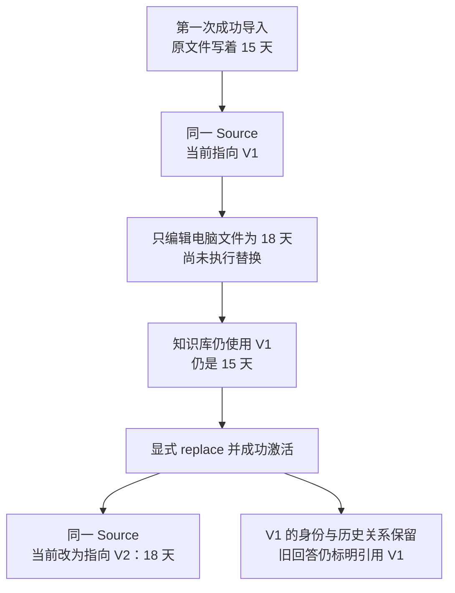
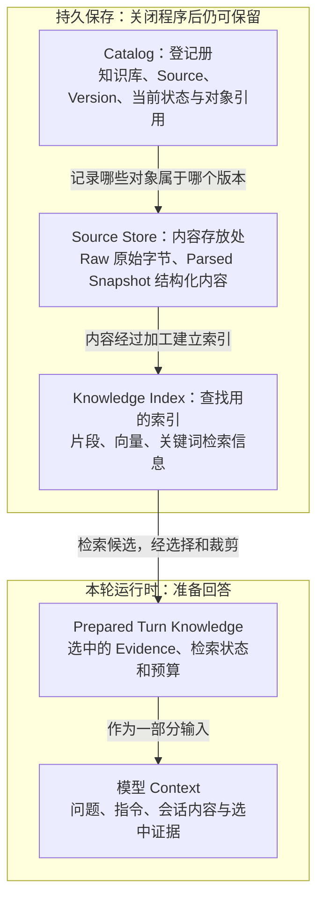
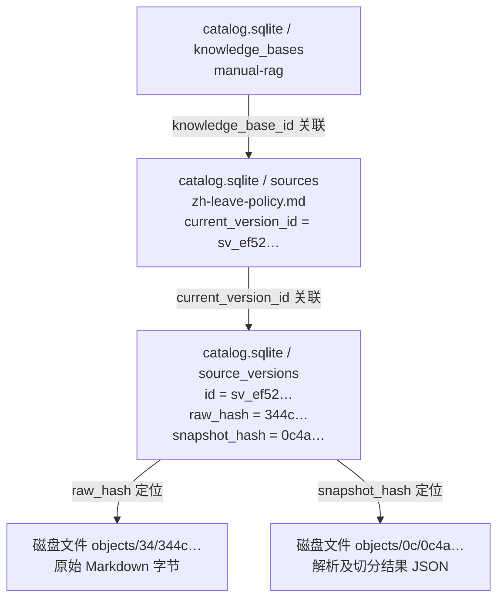
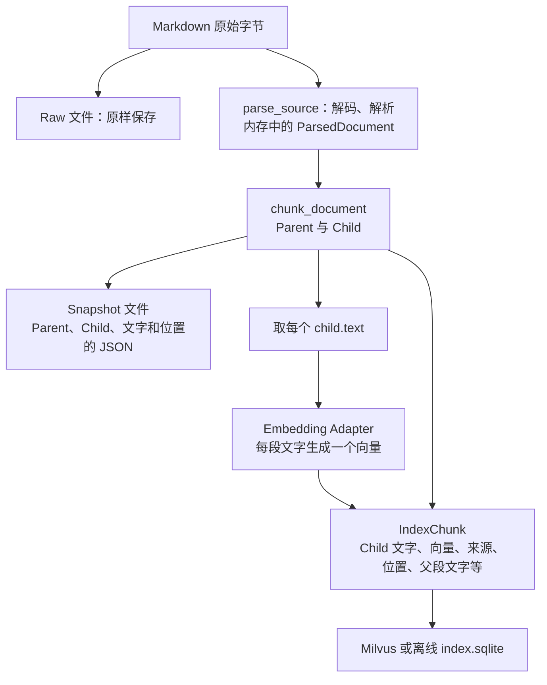
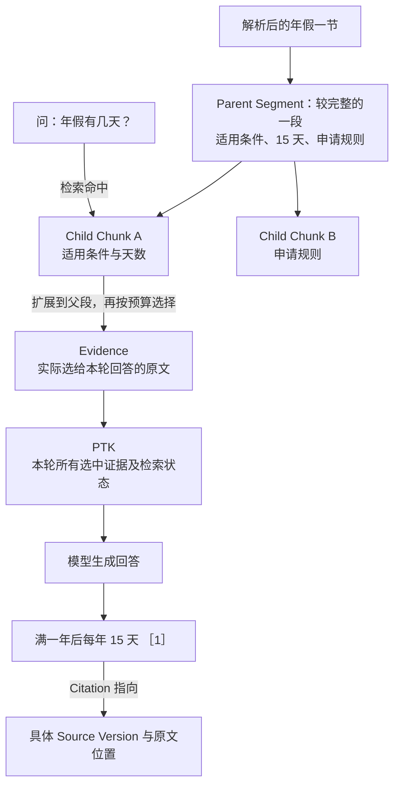

# 用一份休假政策读懂 v0.3 RAG

状态：`Implemented`（图解说明已编写，不表示产品验收通过）

日期：2026-09-16

本页面向不准备逐行看代码的读者，用同一份文件解释[词汇表](v0.3-rag-glossary.md)和
[高层设计](../architecture/v0.3-knowledge-retrieval.md)。本页解释既有概念，不新增设计决策。
先读第 1–3 节理解五个基本概念，再读后面的版本变化、存储和回答流程。

## 1. 从你已经认识的文件开始

假设电脑上有一份 `休假政策.md`，内容写着：

> 全职员工入职满一年后，每年享有 15 天带薪年假。

你把它导入“人事知识库”，以后问“员工有几天年假？”。系统要完成两段工作：



**这两段发生在不同时间。** v0.3 在导入时解析文件；提问时使用已经准备好的索引和内容。
模型通常只收到选中的片段，不会因为绑定知识库就读到整个知识库。

现在给上述内容加上项目中的正式名字：

| 你关心的事 | 名字 | 在这个例子中 |
| --- | --- | --- |
| 我选了哪个电脑文件？ | Source Document，来源文档 | 你自己管理的 `休假政策.md` |
| 知识库把它当作哪一份资料管理？ | Knowledge Source，逻辑来源 | “休假政策”这一条稳定资料身份 |
| 我导入的是这份资料的哪一次内容？ | Source Version，来源版本 | 写着 15 天的那一版 |
| 当时收到的文件到底是什么样？ | Raw Source Artifact，原始内容对象 | 那次导入的原始字节副本 |
| 按哪些标题、段落或表格位置来理解它？ | Parsed Source Snapshot，解析快照 | 标题为“年假”，下面的段落写着 15 天 |
| 这些资料放在哪个管理范围里？ | Knowledge Base，知识库 | “人事知识库”，还可以放报销说明、员工表等 |

这里的“身份”“记录”“内容对象”是不同职责，并不意味着用户要手动维护六个文件。
它们由导入和知识管理流程建立、关联。

## 2. Source、Version、Raw 和 Snapshot 分别是什么

### 2.1 Knowledge Source：知识库给一份资料建立的稳定身份

你电脑上的文件可以被编辑、移动或删除；JDAgent 需要独立回答：“这份资料之前导入过吗？
现在使用哪个版本？是否停用？旧回答引用的是它吗？”因此它为资料建立一条 Knowledge Source。

可以把它想成资料登记卡：有一个稳定 ID、一个名称、所属知识库、当前状态，以及当前版本的指向。
“休假政策”从 15 天改为 18 天后，仍然可以沿用同一张登记卡。

| 比较项 | 电脑上的 Markdown 文件 | Knowledge Source |
| --- | --- | --- |
| 表达什么 | 外部文件与其当前内容 | 知识库中被管理的逻辑资料 |
| 由谁管理 | 原文件的所有者 | JDAgent 的知识管理模块 |
| 改动内容后 | 文件原位置可能直接被改写 | 显式替换时保留来源身份，建立新版本 |
| 能表达停用、历史版本关系吗 | 文件本身通常不表达 | 这是来源管理的一部分 |

**不是改了电脑文件，知识库就自动更新。** v0.3 没有文件监控同步；要显式导入/替换。
当前 CLI 使用同一知识库中的文件名寻找要替换的 Source，但 Source 的身份是它的 ID，
不是这个文件路径。当前 CLI 也不能据此推断任意改名文件都是同一来源。

### 2.2 Source Version：固定某一次导入内容的版本记录

它回答“这条资料当时具体是哪一版内容”。它拥有独立身份，并关联当时的原始内容和解析结果。

**它不要求采用 `0.1`、`0.2` 这样的数字版本号。** 当前实现生成的是 `sv_...` 形式的唯一 ID。
下文写“V1/V2”只是方便阅读的简称，不是实际编号规则，也不表示产品版本 `v0.3`。

把一个版本记录摊开，可以这样理解：

| 版本记录中的信息 | 例子/含义 |
| --- | --- |
| 版本身份 | 这一版独有的 ID |
| 所属来源 | 它属于“休假政策”这一 Source |
| 原始内容校验值与引用 | 找到并核验那份写着 15 天的 Raw 对象 |
| 编码及选择方法 | 例如按 UTF-8 解码，编码是显式指定还是检测得到的 |
| 解析关联 | 当前实现记录解析结果的校验值与 Parser Profile |
| 创建时间 | 这一版本记录何时建立 |

**版本记录通过引用找到正文对象，不必把正文全部塞在记录里。** 这些引用是系统内的关联，
不一定是网址，也不是答案里的 `[1]`。答案 Citation 是之后回答时才建立的关系。

“不可变”意味着旧版内容不会被新版原地改写；新版本成功激活后，Source 的“当前版本”指向它。
导入失败时可能已经留下尚未激活的版本记录，所以“有版本记录”也不等于“现在可检索”。

### 2.3 Raw Source Artifact：收到什么字节，就保存什么字节

它是导入当时的原始输入副本。**Raw 不会因为解析需要而被统一重编码。**

例如原文件采用 GBK 编码，Raw 保存的仍是这份 GBK 字节；解析器按 GBK 解码后才能理解中文。
如果原文件本来是 UTF-8，Raw 就保存 UTF-8 字节。解析后的结构可以另行保存为 UTF-8 JSON，
那是解析快照的保存形式，不能把它叫作重编码后的 Raw。



保留 Raw，是为了能够核验“系统当时实际收到了什么”，以及将来使用新的解析方法重新处理。
它的存储文件名可以是内容哈希，不一定仍叫 `休假政策.md`，但这不会改变被保存的原始字节。
格式、编码、校验等配套信息可以保存在关联元数据里，并不要求都塞进同一个物理文件。

### 2.4 Parsed Source Snapshot：保存下来的结构化解析结果

你的理解中，“它经过了解析”这一点是对的；需要纠正的是**它不只是 Agent Runtime 的临时内存**。
导入模块在导入时完成解析并保存 Snapshot，关闭程序后它仍然存在，直到按生命周期规则清理。

以 Markdown 为例，可以把快照理解为这样的内容：

| 原文中的东西 | 解析后知道的事情 |
| --- | --- |
| `## 年假` | 这里是一个标题，下面的内容属于年假一节 |
| “满一年后，每年享有 15 天……” | 这里是一段文字，并保存它的结构位置 |
| 一张员工表 | 有哪些列、哪些行、单元格属于哪里 |

Snapshot 保存的是结构化内容和定位信息；不自动包含模型对政策的理解、总结或判断。
解析器本身会短暂使用内存，但这与“解析结果是否持久保存”是两件事。

**当前代码先解析、再切分，最后把 Parent 和 Child 一起保存成 Snapshot。**
`parse_source()` 返回的 `ParsedDocument` 是中间内存对象；磁盘上的 Snapshot 是后续序列化的
JSON，包含父段、子块、文字和位置。当前导入过程直接使用内存里的 Child 生成向量，
不需要先保存 Snapshot、再把它读回来切分。第 5.4 节给出具体调用顺序。

真正与“这一次提问临时交给模型什么”接近的概念，是后文的 **Evidence / Prepared Turn Knowledge**。

## 3. Knowledge Base 是不是 Source Version 的集合

**从可检索内容看，可以近似理解为“一组当前有效的来源版本”；从管理结构看，还要包括来源身份、
历史关系、启停状态和检索配置。** 只说“版本集合”，会遗漏谁是同一份资料、哪版当前生效等信息。



图中的箭头标明的是**管理、版本或引用关系**，不是从上到下逐步执行的流水线。
V1 和员工表 V1 也各有关联的内容对象，图中为了清晰省略。

在这个例子中，一次新的正常查询可以使用“休假政策 V2 + 员工表 V1”。旧版休假政策 V1
仍可作为历史关系保留，但不能仅因为它还存着，就让它与 V2 同时作为当前政策参与检索。

知识库也不等于一个电脑文件夹、一个 Session 或一个 Milvus Collection。它是业务上的管理范围；
具体文件存储和检索索引，是实现这个范围的不同设施。

### 3.1 在代码里，创建知识库就是插入一条记录

当前实现中，Knowledge Base 的具体落点是 **`catalog.sqlite` 数据库中 `knowledge_bases`
表的一行**。[`KnowledgeCatalog.create_knowledge_base()`](../../src/jdagent/knowledge/catalog.py)
执行的关键 SQL 如下（省略参数绑定）：

```sql
INSERT INTO knowledge_bases (
    knowledge_base_id, connection_id, name, status,
    embedding_profile_json, retrieval_profile_json, language_profile,
    current_generation_id, current_revision, created_at, updated_at
) VALUES (...);
```

以 2026-09-16 手动实验中的 `manual-rag` 为例，该记录包含：

| 字段 | 实验中的值或用途 |
| --- | --- |
| `knowledge_base_id` | `kb_dda45794616f4c69b354dc43aa8c6906`，库的唯一 ID |
| `name` / `status` | `manual-rag` / `active` |
| `connection_id` | 指向使用哪个连接配置 |
| `embedding_profile_json` | 向量维度为 1024，模型名与服务地址为空 |
| `retrieval_profile_json` | 检索模式为 `hybrid_rrf`，并记录候选数、证据预算等 |
| `current_generation_id` | 指向当前索引代 |
| `current_revision` | 当时为 `4`，表示内容可见性版本，不是四个 Source Version 的编号 |

导入的资料通过 `sources.knowledge_base_id` 归属于这个库。因此查某个库有哪些资料，本质上是：

```sql
SELECT * FROM sources WHERE knowledge_base_id = ?;
```



读出数据库记录后，代码把它转换为
[`KnowledgeBaseRecord`](../../src/jdagent/knowledge/types.py) Python 对象。
这个对象只有 ID、名称、配置等字段，**不包含全部文档正文**。

因此要区分两个用法：“知识库记录”是这张表的一行；日常说“整个知识库”，则包括这条记录
及其关联的来源、版本、正文文件和检索数据。资料归属由数据库字段表达，不要求每个库独占一个文件夹。

## 4. 内容从 15 天改到 18 天，到底发生了什么



| 发生的操作 | 哪些保持不变 | 哪些发生变化 |
| --- | --- | --- |
| 只编辑电脑文件 | Source、已导入的 V1、当前检索内容 | 外部文件 |
| 成功替换为 18 天 | Knowledge Base、Source 身份、V1 内容 | 新 V2、新 Raw、新解析结果，当前可见内容更新 |
| 停用休假政策 | 已保存的版本内容 | 当前查询不再使用该来源 |
| 重新启用 | 当前版本的内容 | 当前查询重新可以使用它 |
| 用新解析规则重解析同一内容（设计能力） | Source Version 与 Raw | 派生新的 Parsed Snapshot，可能需要新一代索引 |

最后一行是已批准设计的关系：同一原文可以有多份不同解析规则下的快照。
**当前实现还没有完整的多 Snapshot 管理和重解析入口**，不能把图中关系理解为相关操作都已交付。

把旧版本的内容保存下来，是为了具备历史核验的基础；当前历史 Citation 打开路径仍有缺口，
所以“保留旧版本关系”不等于“界面已经能够完整打开历史原文”。

## 5. 它们分别存在哪里，哪些只是本轮内存

无需记数据库字段，只需分清“登记、内容、检索、当轮输入”四类职责。



| 对象 | 是否保存下来 | 保存它主要为了解决什么 |
| --- | --- | --- |
| Source、Version 关系 | 是，Catalog 管理 | 知道资料是谁、属于哪版、当前是否生效 |
| Raw | 是，Source Store 管理 | 保留导入时的原始字节 |
| Parsed Snapshot | 是，Source Store 保存内容 | 保留解析结果，不在每次提问时重新解析 |
| Index | 是，可以从来源重新建立 | 快速找到相关内容 |
| 本轮 PTK | 当前 Turn 的内存输入 | 固定这轮实际提供的证据与检索状态 |
| 检索记录、答案、Citation | 作为 Session 事实保存 | 追踪某次回答实际用了什么；检索记录不保存 Evidence 全文 |

图表示职责，不要求每一类对象独占一个文件或数据库。两个来源如果收到完全相同的字节，
底层可以共享同一个内容对象；它们的 Source 身份仍然不同。

当前实现把 Snapshot 的结构保存为内容对象，也在索引里存放父段文本副本；提问时父段正文目前从
索引副本取得，尚未完整走 Source Store 核验加载。这是实现补齐项，不改变 Snapshot 是持久对象的含义。

### 5.1 磁盘上实际有哪些文件

当前路径由 [`DataPaths`](../../src/jdagent/data_paths.py) 组织。手动实验把用户数据目录重定向到
临时实验目录，因此该次数据位于实验目录下的 `data/JDAgent/knowledge/`。主要结构如下，
哈希文件名仅展示前缀：

```text
knowledge/
├── catalog.sqlite       # 知识库、来源、版本等管理记录
├── index.sqlite         # 离线索引后端：Chunk、向量等检索记录
├── objects/
│   ├── 34/
│   │   └── 344c563d…    # 休假政策的原始字节副本
│   └── 0c/
│       └── 0c4a0256…    # 休假政策解析、切分后的 JSON
└── backups/             # Catalog 备份
```

**持久保存不等于每个对象独占一个文件。** 对应关系是：

| 概念 | 当前物理保存形式 |
| --- | --- |
| Knowledge Base | `catalog.sqlite` → `knowledge_bases` 表的一行 |
| Knowledge Source | `catalog.sqlite` → `sources` 表的一行 |
| Source Version | `catalog.sqlite` → `source_versions` 表的一行 |
| Raw Source Artifact | `objects/` 下的独立文件，保存原始字节 |
| Parsed Source Snapshot | `objects/` 下的独立文件，保存 UTF-8 JSON，包含 Parent、Child 和位置 |
| Chunk、向量及检索所需字段 | 离线后端存入 `index.sqlite`；选择 Milvus 后由 Milvus 保存 |
| 本轮 PTK | 运行时内存对象；Session 另存检索记录，不等于保存完整 PTK 正文 |

[`ContentAddressedStore.path_for()`](../../src/jdagent/knowledge/store.py) 用下面的规则定位文件：

```python
return self._root / digest[:2] / digest
```

Raw 与 Snapshot 共用 `objects` 目录，文件名是内容的 SHA-256，没有 `.md` 或 `.json` 后缀。
没有扩展名不影响文件内容；也不是把原 Markdown 重命名后搬走，而是保存导入时收到的内容副本。
Milvus 后端的数据由服务管理，不能把本地 `index.sqlite` 当成 Milvus 的数据文件。

### 5.2 Catalog 就是一个 SQLite 数据库及其管理代码

当前 Catalog 不需要独立数据库服务器，也不是 Milvus 内的一部分：

| 名称 | 实际是什么 |
| --- | --- |
| `catalog.sqlite` | 磁盘上的 SQLite 数据库文件 |
| `KnowledgeCatalog` | Python 类，封装这个数据库的增删改查 |
| `knowledge_bases`、`sources` 等 | 该数据库内部的表 |

**Catalog 是整个管理数据库；Knowledge Base 是其中一张表的一条记录。**
当前 [`catalog.py`](../../src/jdagent/knowledge/catalog.py) 创建的主要表包括：

| 表 | 保存什么 |
| --- | --- |
| `connections` | 连接配置 |
| `knowledge_bases` | 知识库身份和配置 |
| `bindings` | 工作区与知识库的绑定 |
| `sources` | 资料身份、状态、当前版本指向 |
| `source_versions` | 版本身份、Raw/Snapshot 哈希、编码、解析配置等 |
| `operations`、`leases` | 操作进度与写入协调信息 |
| `generation_chunks` | 来源与索引中 Chunk 的对应关系 |

### 5.3 从表的一行找到正文文件

以下使用同一次实验中的休假政策，ID 和哈希仅展示前缀：



读取某版原文时，可以先从 `source_versions` 取得 `raw_hash`，再按
`objects/<哈希前两位>/<完整哈希>` 找到并读取文件。这就是“Catalog 保存引用，Source Store
保存内容”的具体含义。此处解释存储关联，不表示历史 Citation 打开流程已经完整实现。

### 5.4 切谁的内容，在哪一步生成向量

**切分对象是原文件解码、解析后的文本块；Embedding 的输入是每个 Child Chunk 的 `text`。**
当前 [`KnowledgeIngestion.add_file()`](../../src/jdagent/knowledge/ingestion.py) 的关键顺序如下
（节选代码，省略版本登记、操作状态及索引记录组装）：

```python
# 原始字节解码后，识别标题、段落等结构。
parsed = parse_source(data, source_format=source_format, encoding=encoding)

# 对解析出的文本块组织、切分，产生 Parent 与 Child。
parents = chunk_document(parsed)

# 此处把 Parent、Child 的文字和位置序列化为 JSON，保存为 Snapshot。

# 收集每个 Child 的文本，而不是原始文件字节或整个 Snapshot JSON。
children = [(parent, child) for parent in parents for child in parent.children]
texts = tuple(child.text for _parent, child in children)

# 每段 Child 文本生成一个对应的向量。
embedded = await self._embedding.embed(
    texts,
    kb.embedding_profile,
    input_kind=EmbeddingKind.DOCUMENT,
)

# 组装 IndexChunk 后，将文字、对应向量、来源与位置等写入索引后端。
self._index.upsert_chunks(generation_id, index_chunks)
```



[`parsing.py`](../../src/jdagent/knowledge/parsing.py) 负责解码和识别结构；
[`chunking.py`](../../src/jdagent/knowledge/chunking.py) 优先按结构生成 Child，过长文本块
默认按 800 个字符强制切分，强制切分的相邻块重叠 80 个字符。这是字符数，不是 Token 数。
当前导入路径为 Child 文本生成向量，父段正文作为额外上下文保存在索引记录里。

### 5.5 离线实验与真实 Embedding/Milvus 路径

[`cli.py`](../../src/jdagent/knowledge/cli.py) 根据知识库配置选择 Embedding 实现：

```python
embedding = (
    OpenAICompatibleEmbedding()
    if profile.base_url and profile.model
    else HashEmbedding()
)
```

| 路径 | 向量如何产生 | 检索记录存在哪里 |
| --- | --- | --- |
| 本次离线手动实验 | `HashEmbedding` 根据文本哈希生成可重复的测试向量 | `FileKnowledgeIndex` → `index.sqlite` |
| 配置真实服务后的路径 | `OpenAICompatibleEmbedding` 把 Child 文本发到 `/embeddings`，取得模型向量 | 配置 Milvus endpoint 后，由 `MilvusKnowledgeIndex` 写入 Milvus |

Embedding 服务与索引后端是分别选择的组件，并非只能采用上表的两种组合。
2026-09-16 核对的 `manual-rag` 实验配置中，Embedding 的 `base_url` 和 `model` 均为空，
使用的是 HashEmbedding 和本地索引。**HashEmbedding 没有语义理解能力；存在 1024 维向量
不代表已经使用或验证了真实语义 Embedding 模型。**

[`MilvusKnowledgeIndex.upsert_chunks()`](../../src/jdagent/knowledge/milvus.py) 接收已经生成好的
向量，并连同 Child 文字、来源 ID、版本 ID、位置、父段文字等写入 Milvus。Milvus 在这条
稠密向量路径中负责存储、索引和相似度检索，不负责本项目的文档切分或调用 Embedding 模型。
本节的“向量”指 Child 的稠密 Embedding；关键词/BM25 路径是另外一种检索机制。

因此，离线实验验证的是本地导入、数据关联与检索流程，不能单凭它认定真实语义检索或
Milvus 服务已经验证通过。

## 6. 从 Snapshot 到模型：还有哪些词需要认识

### 6.1 先找小片段，再给足上下文



本图的切分只用于解释大小关系，不承诺这一份短文件一定被当前切分器切成两块。

| 词 | 先这样理解 | 和相邻概念的区别 |
| --- | --- | --- |
| Parent Segment | 能提供较完整上下文的较大段 | 适合让模型理解上下文 |
| Child Chunk | 用于精确查找的较小片段 | 命中它后，可能扩展到 Parent |
| Locator | 原文里的结构位置，如标题下第几段、表格哪行哪列 | 不是磁盘文件路径；必须结合具体版本/快照解释 |
| Evidence | 本轮真正选中并提供给回答的原文 | 候选没有被选中，就还不是这轮 Evidence |
| PTK | 本轮证据包，带状态和预算 | 不是整个知识库，也不是全部模型 Context |
| Citation | 回答里的主张到证据位置的引用关系 | 有引用只能证明能定位，仍要检查原文是否支持主张 |

### 6.2 剩余概念先按问题查，不必一次背完

| 你想问的问题 | 对应概念 | 一句话理解 |
| --- | --- | --- |
| 从哪个知识服务访问？ | Knowledge Provider / Connection | Provider 提供知识访问边界；Connection 保存它的身份与访问配置 |
| 当前工作区允许查哪些库？ | Workspace Knowledge Binding | 工作区与指定知识库的持久授权关系 |
| 这轮实际能查哪些库？ | Effective Knowledge Bases | Turn 开始时从 Binding 等状态解析出的范围 |
| 怎样把文档和问题变成可比较的向量？ | Embedding Profile | 固定模型、维度、归一化等规则 |
| 怎样理解关键词的语言和词项？ | Retrieval Language Profile | 关键词分析规则，和向量模型是两类配置 |
| 怎么召回、合并和限制证据长度？ | Retrieval Profile | 本次采用的候选选择与预算规则 |
| 同一份原文为何能有不同解析结果？ | Parser Profile / Locator Schema | 解析方法与位置表示规则可能演进 |
| 这次回答没被资料支持的部分是什么？ | Model Supplement | 模型自行补充的知识，需要与有来源部分区分 |

还有四种“版本”特别容易混淆：

| 名字 | 管的是谁的变化 | 例子 |
| --- | --- | --- |
| Source Version | 一份资料的内容版本 | 15 天改为 18 天 |
| Parsed Snapshot | 某版内容的一次结构化解释 | 原字节没变，换一种表格解析/定位规则 |
| Index Generation | 一整代索引的兼容规则 | 换向量模型、维度或不兼容的索引配置 |
| Content Revision | 同一代索引下哪些内容可见 | 停用休假政策后，新查询不再看见它 |

前三者的身份不需要是连续数字；Content Revision 也不是 Source Version 的数字别名。
**理解它们各自回答哪个问题，比记住英文缩写更重要。**

## 7. 图解、设计和实现之间的边界

本页五个基本概念与[批准词汇表](v0.3-rag-glossary.md)、[高层设计第 6 节](../architecture/v0.3-knowledge-retrieval.md#6-knowledge-catalog-与-source-store)
一致。具体实现状态以[当前状态](current.md)与[实现审查](../reviews/REV-20260905-001-v0.3-implementation-audit.md)为准。

2026-09-16 对 `1cb5b48` 的只读代码核对确认：Source 有独立身份和当前版本指向；Source Version 是 `sv_...` 标识的
记录；Raw 原样保存；Snapshot 结构持久保存。多 Snapshot 管理、完整索引重建、历史原文核验、
物理删除等仍有缺口。本页不把这些设计目标记为已经通过验收。

读完可以再进入[手动验证报告](../development/v0.3-rag-manual-verification.md)：先导入 15 天版本，
再替换为 18 天，用实际输出对应本页的 Source、Version 与 Evidence；无需先阅读实现代码。
